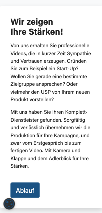
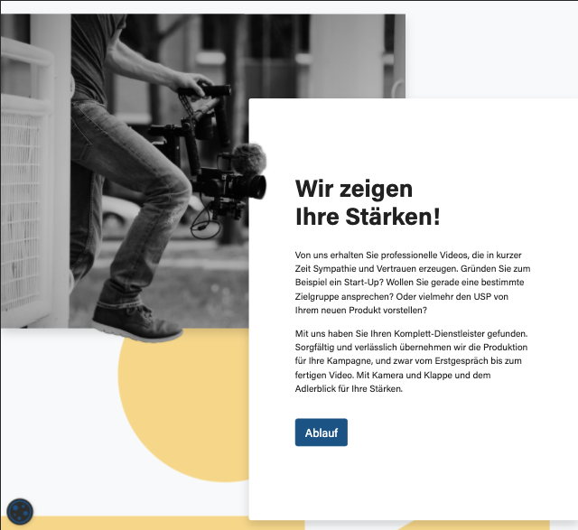
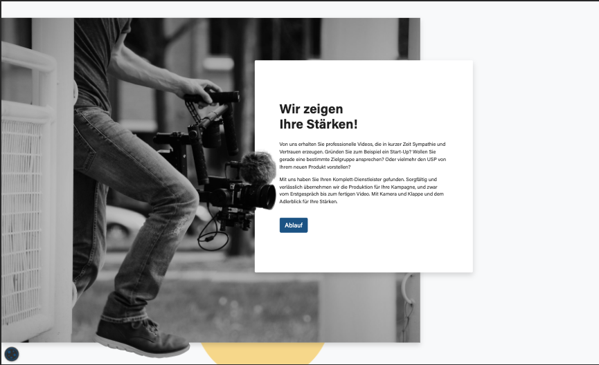

# test-task-2

## Build Setup

```bash
# install dependencies
$ npm install

# serve with hot reload at localhost:3000
$ npm run dev

# build for production and launch server
$ npm run build
$ npm run start

# generate static project
$ npm run generate
```

For detailed explanation on how things work, check out [Nuxt.js docs](https://nuxtjs.org).

## Tasks

### 1. Setup

**Install Bootstrap Vue like you did in `task-1`, so you have access to all bootstrap scss variables**.

### 2. Turn these images (same section - different breakpoints) into code

**Write HTML and SCSS for the following section and follow the rules below**

2.1 The css must be fully responsive from 320px to 1920px screen width.

2.2 You must not use more than one css breakpoint to achieve a fully responsive result. All proportions and sizes should automatically adjust themselves. Give yourself some time to think about it. Write your scss in such a dynamic way that it looks good on all sizes, without having to use more than 1 single breakpoint.

2.3 Use the internal bootstrap scss breakpoint mixin `@include media-breakpoint-up(md){}` to write all desktop related code inside this mixin. For everything that's smaller than `md` screen width, you can just hide the image and only display the right column.

**Hint 1.** You can use Lorem Ipsum Text, so you don't have to retype everything.

**Hint 2.** You can completely ignore the yello dot-background behind the image

**Hint 3.** You can entirely ignore the font-family.

**Hint 4.** The **only** reason to use the one and only allowed css breakpoint is to hide the image for the mobile version. Nothing more.

You will find all required assets in `@/assets/`

Here are the screenshots:

320px:



1000px:



1280px:


1920px:



### 3. Turn another image of a page section into code

**Write HTML and SCSS the following section and follow the rules below**

3.1 We want the content side of the section to be perfectly aligned with the `.container` grid, in order to align this section with all other sections. So, you must use a bootstrap `.container` > `.row` -> 2x `.col-lg-6` grid layout for the section. But still the image on the right side must always reach the right border.

3.2 The image in the right column must have 100vh.

3.3 You must not write the image as a background-image, but instead you must write the image as an `` tag.

3.4 Now you end up with a dynamic image height, a dynamic image width (both in relation to the browser window size) which is put inside an `` tag and you need to make sure that it's never distorted.

**Hint 1.** You can use Lorem Ipsum Text, so you don't have to retype everything.

**Hint 2.** You can entirely skip the contact icons.

You will find all required assets in `@/assets/`

Here is the screenshot

1280px:


